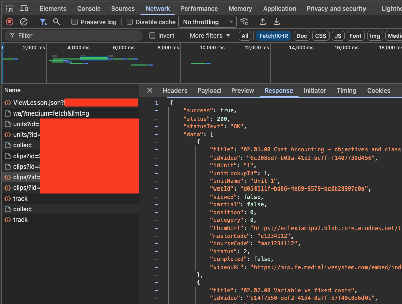
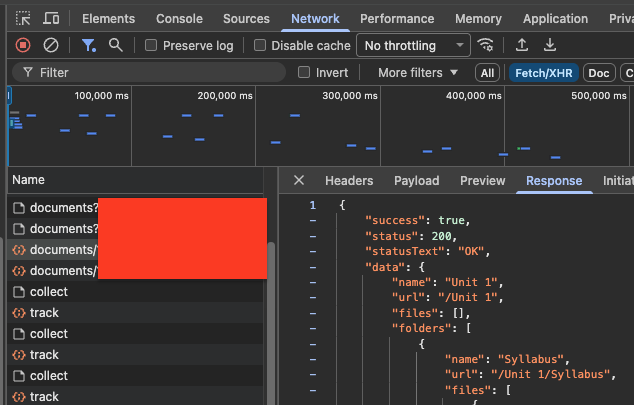
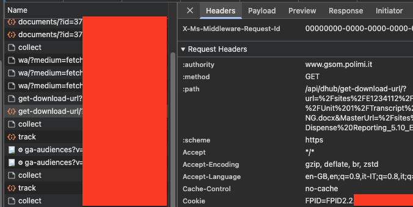

# Clippa

Profoundly unofficial scripts to download documents and videos (aka clips) from the FLOW platform of the Polimi Graduate School of Management.

## Download video lessons (clips)

1. Get the JSON that is received by the browser as soon as the page with clips is loaded (use Developer tools >
   Network > Response with Fetch/XHR filter). The request is the one starting with `clip/?...`. `FLEX_MA_videos.json` is
   used in the example.

2. Run `rippacorso.py` to download all clip manifests and generate a `manifest.json`. Edit the output if not all videos
   are needed.

3. Run `rippaclippa.py` to download all clips in `manifest.json` provided.

## Download documents (from the Documents section)

1. Get the JSON that is received by the browser as soon as the page with notes is loaded.

2. Download one file manually and copy your authentication cookies from the request starting
   with `get-download-url/?...` > Request Headers > Cookie and store it in the file `cookie_notes.txt`. Cookies have
   short expiration dates so this must likely be done any day notes are downloaded.

3. Run `rippadocs.py` to download all notes. The original folder tree is preserved.

4. Run `marge.py` to merge notes as you like.

## Obsolete

### Download transcripts (from links in clips)

1. Check what the first and last transcript number is by manually downloading it from the first and last clip.

2. Run `rippatranscript.py` to download all notes.

3. Run `marge.py` to merge notes as you like.

### Videos from sh
`rippaclippa.sh` is the first version, but it's still good if you need to download a single clip, it takes a
list of manifest URLs and downloads them
